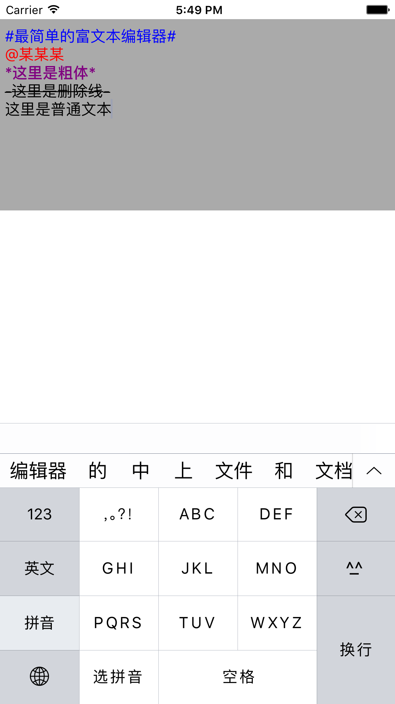

# MWTextView
iOS Rich TextView Editor Like Sina Weibo

iOS端最简单的富文本编辑器，可以很简单的进行扩展

特性
==============
- 代码简单
- 文本实时高亮
- 支持自定义文本解析
- 支持富文本占位符
- 最低支持`iOS 6.0`
- 暂时还没支持插入图片

用法
==============
``` objc
    _textView = [[MWTextView alloc] initWithFrame:CGRectMake(0.f, 20.f, [UIScreen mainScreen].bounds.size.width, 200.f)];
    _textView.backgroundColor = [UIColor lightGrayColor];
    _textView.font = [UIFont systemFontOfSize:16.f];
    _textView.textColor = [UIColor blackColor];

    NSMutableAttributedString *atr = [[NSMutableAttributedString alloc] initWithString:@"写点什么？"];
    [atr setAttributes:@{ NSFontAttributeName : [UIFont systemFontOfSize:16.f],
                          NSForegroundColorAttributeName : [UIColor blueColor] }
                 range:NSMakeRange(0, atr.length)];
    _textView.attributedPlaceholder = atr;

    _textView.regexAttributes = @{ @"@[-_a-zA-Z0-9\u4E00-\u9FA5]+" : @{NSForegroundColorAttributeName : [UIColor redColor]} };

```

效果
==============

